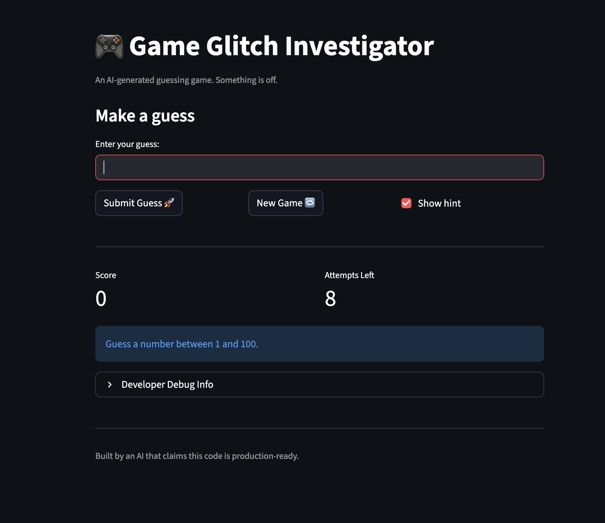

# 🎮 Game Glitch Investigator: The Impossible Guesser

## 🚨 The Situation

You asked an AI to build a simple "Number Guessing Game" using Streamlit.
It wrote the code, ran away, and now the game is unplayable. 

- You can't win.
- The hints lie to you.
- The secret number seems to have commitment issues.

## 🛠️ Setup

1. Install dependencies: `pip install -r requirements.txt`
2. Run the broken app: `python -m streamlit run app.py`

## 🕵️‍♂️ Your Mission

1. **Play the game.** Open the "Developer Debug Info" tab in the app to see the secret number. Try to win.
2. **Find the State Bug.** Why does the secret number change every time you click "Submit"? Ask ChatGPT: *"How do I keep a variable from resetting in Streamlit when I click a button?"*
3. **Fix the Logic.** The hints ("Higher/Lower") are wrong. Fix them.
4. **Refactor & Test.** - Move the logic into `logic_utils.py`.
   - Run `pytest` in your terminal.
   - Keep fixing until all tests pass!

## 📝 Document Your Experience

### Game Purpose
A number guessing game built with Streamlit where players try to guess a secret number within a limited number of attempts across three difficulty levels (Easy, Normal, Hard). The game provides hints, tracks score, and displays guess history.

### Bugs Found

Turns out the AI that "ran away" left behind more than just commitment issues — it left a full crime scene. The hints were backwards, telling you to go higher when you were already too high, and the secret number quietly turned itself into a string every other guess so winning was literally a coin flip. The UI lied about the range, "New Game" didn't actually start a new game, and the scoring formula managed to both shortchange your wins and reward some wrong answers. Attempts started at 1 instead of 0, invalid inputs counted as guesses, and the "Show hint" toggle did absolutely nothing after submitting. Maybe it will be playable again but who cares about mental state, let's play the game and hopefully have some fun!

### Fixes Applied

I started by fixing the core gameplay. The hint messages got swapped so they actually point you in the right direction, and I removed the string casting so the secret number stays as an integer on every attempt. The score formula was corrected to `100 - 10 * attempt_number` and I made the penalty a flat -5 for any wrong guess regardless of direction, keeping things fair and predictable. I also added a floor so the score can't drop below zero.

For the state and UI bugs, I set the initial attempt count to 0, made the range display pull from the actual difficulty settings, and expanded the "New Game" button to fully reset everything including score, status, history, and hints. Invalid inputs now get caught before they touch the attempt counter or history. The hint message is saved in session state so toggling the checkbox actually works after you've already submitted a guess.

On the code quality side, I moved all four game logic functions into `logic_utils.py` and had `app.py` import from it. The test suite was rewritten from scratch with 33 tests covering every function and edge case. I also added a guess history chart that plots your guesses against the secret number, and moved the score and attempts display below the submit logic so it updates immediately after each guess.

## 📸 Demo

## 🚀 Stretch Features

